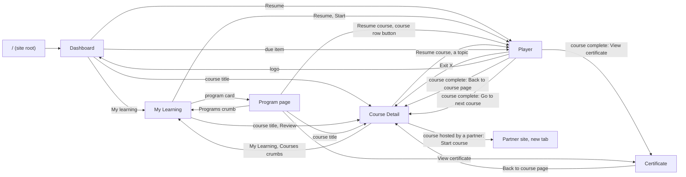

# Navigation flow: Dashboard, My Learning, Program, Course, Player

First pass 8 Oct 2026; second pass 9 Oct 2026, with Nelson's answers to the open questions (§4). It says where every way out of a page leads, in the prototype
(`nvjeronimo/skillup-lms-prototype`) and, by the same rule, in the product. **The shell itself (sidebar or top
bar) is still undecided** and is not part of this document: the destinations are the same either way.

## 1. The rule

Open edX gives every enrolment three addresses (Learner Home, `GET /api/learner_home/init`, metadata map §37):

| Address | What it is | Which control uses it |
|---|---|---|
| `homeUrl` | the course's own page (**Course Detail**) | the course **title** (and its thumbnail), anywhere a course is listed |
| `resumeUrl` | the last unit, in the **player** | the **Resume** / **Start** button |
| `progressUrl` | the Progress tab of the course page | a progress figure, where it is a link |

So: **a title opens the course page, a button opens the player, and leaving the player goes back to the course
page it was opened for.** A finished course has nothing to resume: *Review* opens its course page.

## 2. The map

## 3. Page by page

Status: **wired** = works in the prototype; **stand-in** = a message says it is not part of the prototype;
**open** = needs a decision (§4).

| From | Control | Goes to | Status |
|---|---|---|---|
| Anywhere | site root `/` | Dashboard | wired (8 Oct; it used to open an older course hub) |
| Top bar | logo, *Dashboard* | Dashboard | wired |
| Top bar | *My Learning* | My Learning | wired |
| Top bar | *Calendar*, *Discussion*, *Services*, notifications | their pages | stand-in |
| Dashboard | *My learning* (section link) | My Learning | wired |
| Dashboard | course title in *Pick up where you left off* | that course's page; the program page for the row that is a program | wired (8 and 9 Oct) |
| Dashboard | *Resume* | Player, last unit | wired |
| Dashboard | a due item's title | the assignment in the player | wired (9 Oct) |
| Dashboard | *View calendar*, jump tiles without a page | their pages | stand-in |
| Dashboard | *Certificates* jump tile | Certificate | wired |
| My Learning | course title | Course Detail | wired |
| My Learning | *Resume*, *Start* | Player | wired |
| My Learning | *Review* (finished course) | Course Detail | wired (8 Oct; it used to open the player) |
| My Learning | program card with a page | Program page | wired |
| My Learning | program card without a page, *Browse catalog* | — | stand-in |
| Program page | crumb *My Learning* | My Learning | wired |
| Program page | crumb *Programs* | My Learning, Programs tab | wired (8 Oct; it used to be a stand-in) |
| Program page | *Resume course* (header), a course row's button | Player | wired |
| Program page | a course row's title | that course's page | wired (9 Oct) |
| Program page | *View* on an issued certificate | the certificate page (a proposal, not designed) | wired (9 Oct) |
| Program page | *Download* on a certificate | — | stand-in |
| Course Detail | crumbs *My Learning*, *Courses* | My Learning | wired |
| Course Detail | *Resume course*, a topic, an assignment date | Player | wired |
| Course Detail | *Ask your mentor*, *Ask the course team* | Mentorship Q&A tab | wired |
| Course Detail | *All dates* | Dates tab | wired |
| Course Detail | a search result | Player; Back returns to the search | wired |
| Course Detail | handouts, course tools, *Edit goal*, *Shift due dates* | — | stand-in |
| Course Detail (hosted by IBM) | *Start course*, *Continue on IBM* | IBM, new tab, after a dialog the first time | wired |
| Player | exit **X** | Course Detail of this course | wired (8 Oct; it used to open the old hub) |
| Player | logo | Dashboard | wired (8 Oct) |
| Player | *Previous*, *Next*, a topic in the sidebar | that topic | wired |
| Player | course complete · *View certificate* | Certificate | wired |
| Player | course complete · *Back to course page* | Course Detail | wired (8 Oct; it used to only close the dialog) |
| Player | course complete · *Go to next course* | the page of the next course of the program; My Learning otherwise | wired (9 Oct) |
| Certificate | *Back to course page*, exit X | Course Detail | wired (8 Oct; it used to open the first topic) |

A course without a page of its own in the prototype (the two extra player courses, *capstone* and *quick-start*)
falls back to My Learning.

## 4. Decided by Nelson, 9 Oct 2026

| # | Question | Decision | In the prototype (PR 81) |
|---|---|---|---|
| 1 | Every card opened the same course | **A course shows its own title** | Each course of Dashboard, My Learning and the program has its own page (`/platform/course/<slug>`) and player address. The body and the player topics are still the one sample course |
| 2 | A course inside a program | **Its title opens the course page** | Title → course page, button → player, on the seven rows |
| 3 | Coming from a program | **The course page shows the path** | Breadcrumb *My Learning › Programs › the program › the course*. It follows membership: a course of a program shows it whatever the way in |
| 4 | *Go to next course* | **The next course of the program** | Opens that course's page; My Learning for the last course or a course of no program |
| 5 | Due items on the Dashboard | **They open the work** | The title opens the assignment in the player (the Dates API gives each item its link) |
| 6 | The program's certificates | **Propose a sample page, and say it is one** | *View* opens `/platform/certificate/<slug>`. **Not designed:** no Figma screen; the page says so at its top |
| 7 | The old course hub at `/` | Asked which page it is | Not removed. It is the first *My Learning* of the prototype (three course cards, *Pick up where you left off*); the root now opens the Dashboard |

### Still open

| # | Question |
|---|---|
| 1 | Keep or remove the old hub's code (`components/views/CourseHub.tsx`) |
| 2 | The certificate page needs a design; and whether a program has a certificate of its own besides its courses' |
| 3 | Should a course of a program opened from *My Learning › Courses* show the program path or the Courses path? Today: the program path |
| 4 | The sample content: every course page and player shows the Six Sigma modules under its own title |

## 5. Not in this pass

The destinations of *Calendar*, *Discussion* and *Services*; the mobile menu's order; what the player's sidebar
header links to; the lab routes (`/lab/…`), which are experiments and are not part of this flow.
