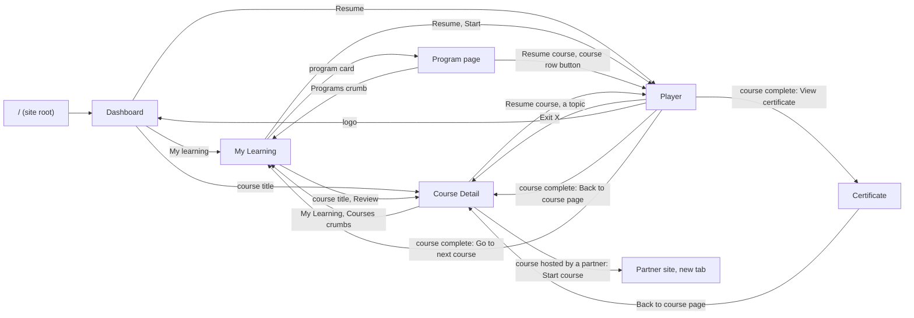

# Navigation flow: Dashboard, My Learning, Program, Course, Player

First pass, 8 Oct 2026. It says where every way out of a page leads, in the prototype
(`nvjeronimo/skillup-lms-prototype`) and, by the same rule, in the product. **The shell itself (sidebar or top
bar) is still undecided** and is not part of this document: the destinations are the same either way.

## 1. The rule

Open edX gives every enrolment three addresses (Learner Home, `GET /api/learner_home/init`, metadata map §37):

| Address | What it is | Which control uses it |
|---|---|---|
| `homeUrl` | the course's own page (**Course Detail**) | the course **title** (and its thumbnail), anywhere a course is listed |
| `resumeUrl` | the last unit, in the **player** | the **Resume** / **Start** button |
| `progressUrl` | the Progress tab of the course page | a progress figure, where it is a link |

So: **a title opens the course page, a button opens the player, and leaving the player goes back to the course
page it was opened for.** A finished course has nothing to resume: *Review* opens its course page.

## 2. The map

## 3. Page by page

Status: **wired** = works in the prototype; **stand-in** = a message says it is not part of the prototype;
**open** = needs a decision (§4).

| From | Control | Goes to | Status |
|---|---|---|---|
| Anywhere | site root `/` | Dashboard | wired (8 Oct; it used to open an older course hub) |
| Top bar | logo, *Dashboard* | Dashboard | wired |
| Top bar | *My Learning* | My Learning | wired |
| Top bar | *Calendar*, *Discussion*, *Services*, notifications | their pages | stand-in |
| Dashboard | *My learning* (section link) | My Learning | wired |
| Dashboard | course title in *Pick up where you left off* | Course Detail | wired (8 Oct) |
| Dashboard | *Resume* | Player, last unit | wired |
| Dashboard | a due item | the assignment in the player | open (not a link today) |
| Dashboard | *View calendar*, jump tiles without a page | their pages | stand-in |
| Dashboard | *Certificates* jump tile | Certificate | wired |
| My Learning | course title | Course Detail | wired |
| My Learning | *Resume*, *Start* | Player | wired |
| My Learning | *Review* (finished course) | Course Detail | wired (8 Oct; it used to open the player) |
| My Learning | program card with a page | Program page | wired |
| My Learning | program card without a page, *Browse catalog* | — | stand-in |
| Program page | crumb *My Learning* | My Learning | wired |
| Program page | crumb *Programs* | My Learning, Programs tab | wired (8 Oct; it used to be a stand-in) |
| Program page | *Resume course* (header), a course row's button | Player | wired |
| Program page | a course row's title | opens and closes the row | open: it is not a link to the course page |
| Program page | *View certificate*, *Download certificate* | the program certificate | stand-in |
| Course Detail | crumbs *My Learning*, *Courses* | My Learning | wired |
| Course Detail | *Resume course*, a topic, an assignment date | Player | wired |
| Course Detail | *Ask your mentor*, *Ask the course team* | Mentorship Q&A tab | wired |
| Course Detail | *All dates* | Dates tab | wired |
| Course Detail | a search result | Player; Back returns to the search | wired |
| Course Detail | handouts, course tools, *Edit goal*, *Shift due dates* | — | stand-in |
| Course Detail (hosted by IBM) | *Start course*, *Continue on IBM* | IBM, new tab, after a dialog the first time | wired |
| Player | exit **X** | Course Detail of this course | wired (8 Oct; it used to open the old hub) |
| Player | logo | Dashboard | wired (8 Oct) |
| Player | *Previous*, *Next*, a topic in the sidebar | that topic | wired |
| Player | course complete · *View certificate* | Certificate | wired |
| Player | course complete · *Back to course page* | Course Detail | wired (8 Oct; it used to only close the dialog) |
| Player | course complete · *Go to next course* | My Learning | wired as a fallback; open |
| Certificate | *Back to course page*, exit X | Course Detail | wired (8 Oct; it used to open the first topic) |

A course without a page of its own in the prototype (the two extra player courses, *capstone* and *quick-start*)
falls back to My Learning.

## 4. Open, for Nelson

| # | Question | Why it matters |
|---|---|---|
| 1 | **Every course on Dashboard, My Learning and Program opens the same course (Six Sigma).** The prototype has one Course Detail and one player course behind every card. Do the other cards get a page that carries their own title, or is one sample course enough for the sessions? | The learner clicks *UX Research and Design Thinking* and lands on *Six Sigma*: the flow is right, the content is not |
| 2 | **A course inside a program: does its title open the course page?** Today the title opens and closes the row | The rule in §1 says a title opens the course page |
| 3 | **Coming from a program, does the course page say so?** The breadcrumb reads *My Learning › Courses › title* whatever the way in | A learner who came from the program loses the way back to it |
| 4 | ***Go to next course*:** which course is next (the next in the program, a recommendation, My Learning)? | The dialog offers it as its Primary action |
| 5 | **A due item on the Dashboard:** should it open the assignment in the player? | It reads like a link and is not one |
| 6 | **The program certificate:** it has no page; the certificate page is the course's | *View certificate* on the Program page is a stand-in |
| 7 | **The old course hub at `/`** is no longer reachable (the root opens the Dashboard). Remove its code? | It was the prototype's first home |

## 5. Not in this pass

The destinations of *Calendar*, *Discussion* and *Services*; the mobile menu's order; what the player's sidebar
header links to; the lab routes (`/lab/…`), which are experiments and are not part of this flow.
